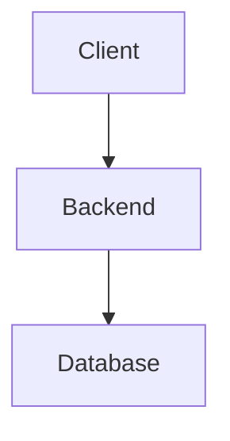
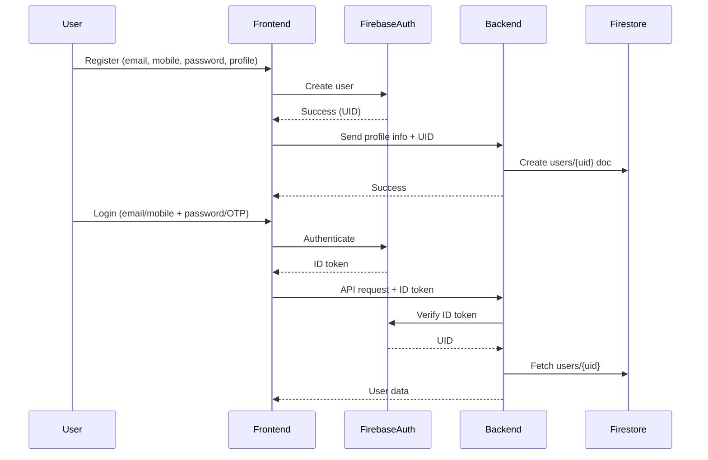

# 🛠️ Architecture Overview

## System Overview

Track Expense Backend is built with NestJS and provides RESTful APIs for user authentication, profile management, and future expense tracking features. It leverages Firebase Authentication for secure user management and Firestore as the primary database.

---

## Main Components

- **NestJS**: Backend framework for building scalable APIs
- **Firebase Auth**: Handles user authentication and token validation
- **Firestore**: NoSQL database for storing user profiles and (future) expense data

---

## 🔄 High-Level Flow

---

## Registration & Login Flow (with Firebase Auth)

---

## Firebase Auth & Firestore Roles
- **Firebase Auth:** Handles user identity, password, email/mobile verification, and social logins.
- **Firestore:** Stores user profile and app-specific data, keyed by Firebase UID.

---

## Request Lifecycle
1. Client sends request to backend (e.g., login, get profile)
2. Backend validates Firebase token
3. Backend processes request and interacts with Firestore
4. Response is sent back to client

---

> This architecture is designed for scalability, security, and easy integration with GCP services in the future. 