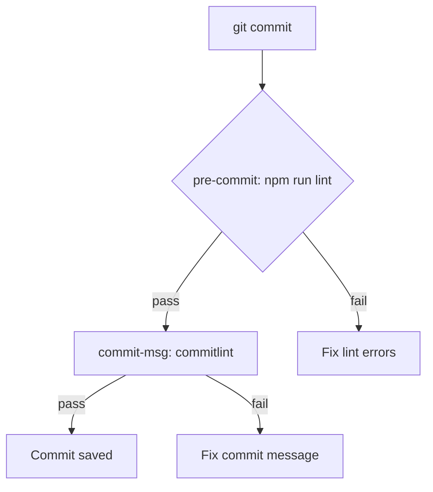

# 🐶 Husky in Track Expense Backend

## What is Husky?

**Husky** is a tool that helps you manage Git hooks easily. Git hooks are scripts that run automatically at certain points in your Git workflow (like before a commit or push). Husky lets you automate checks and formatting, ensuring code quality before changes make it into your repository.

---

## 🚦 What Does Husky Do Here?

In this project, Husky is set up to:

- **Run linting before every commit** (`pre-commit` hook)
- **Check commit message style** (`commit-msg` hook)

This helps keep your codebase clean and your commit history consistent!

---

## 🔍 Configured Hooks

| Hook         | What it does                                 |
|--------------|----------------------------------------------|
| pre-commit   | Runs `npm run lint` before every commit      |
| commit-msg   | Uses Commitlint to enforce commit message style |

---

## 🛠️ How It Works (Diagram)



---

## 💡 Why Use Husky?
- Prevents bad code and style issues from entering the repo
- Enforces best practices automatically
- Saves time in code review

---

## 📦 Related Tools
- [Commitlint](https://commitlint.js.org/): Checks commit message conventions
- [Lint-staged](https://github.com/okonet/lint-staged): (Can be added) Runs linters on staged files

---

## 📝 Commitlint Configuration

- This project uses **Commitlint** with the [`@commitlint/config-conventional`](https://www.npmjs.com/package/@commitlint/config-conventional) preset.
- The following rules are enforced for every commit message:

| Rule                | Description                                                                 |
|---------------------|-----------------------------------------------------------------------------|
| type-enum           | Only these types are allowed: feat, fix, docs, style, refactor, perf, test, build, ci, chore, revert |
| subject-case        | Subject must be lowercase (not sentence, start, pascal, or upper case)      |
| header-max-length   | Commit header must be 72 characters or less                                 |

**Example of a valid commit message:**
```
feat(user): add user profile endpoint
fix(auth): handle expired token error
docs: update README
```

> Your commit message will be checked automatically on every commit! If it doesn't follow the rules, the commit will be rejected until you fix it.

---

> 🐾 **Tip:** You can customize Husky hooks in the `.husky/` folder. 