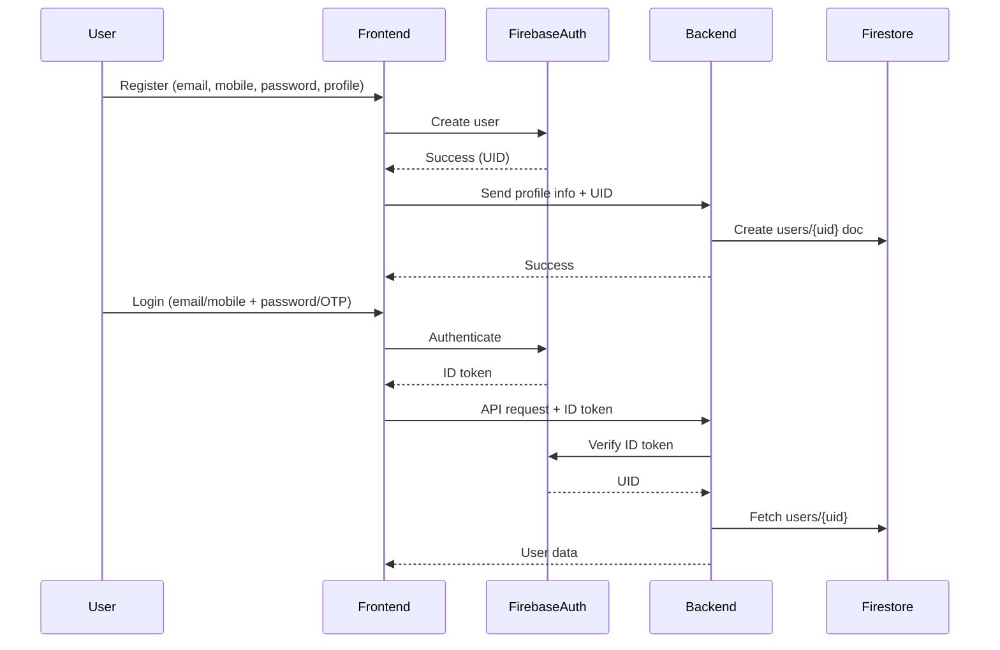

# 👤 User Management Specification

## Overview
User Management is a core feature of Track Expense, supporting robust registration, login, and verification flows for both free and paid users. The system is designed for extensibility, security, and a seamless user experience.

---

## Firebase Authentication Integration

Track Expense uses Firebase Authentication for secure user identity, password management, and verification. Only profile and app-specific fields are stored in Firestore, keyed by the Firebase UID.

### What is managed by Firebase Auth?
- User ID (UID)
- Email and mobile (uniqueness, verification)
- Passwords (securely hashed)
- Social logins (future)

### What is stored in Firestore?
- Profile fields: firstName, lastName, gender, dob, userType, createdAt, updatedAt, lastLoginAt, etc.

---

## Registration & Login Flow



---

## Implementation Notes
- Use Firebase Admin SDK in the backend to verify ID tokens and manage users.
- On registration, create a Firestore profile document after successful Firebase Auth user creation.
- On login, use the ID token to fetch the user’s profile from Firestore.
- Use Firebase Auth’s built-in email and phone verification flows.

---

## Verification Mechanisms
- **Email Verification:**
  - Magic Link: Send a unique link to the user's email. Clicking the link verifies the email.
- **Mobile Verification:**
  - OTP via SMS: Send a one-time code to the user's mobile. User enters the code to verify.
- **Extensible:**
  - System is designed to allow additional verification methods in the future.

---

## User Types & Dynamic Features
- **Free Users:**
  - Can register and login via email or mobile only.
- **Paid Users:**
  - Can integrate and login with social media (Google, Facebook, etc.) in the future.
- **Dynamic Feature Management:**
  - System should easily manage and extend features based on user type (free/paid).

---

## User Data Model (Draft)
```ts
interface User {
  id: string;
  email: string; // unique, required
  mobile: string; // unique, required
  passwordHash: string;
  emailVerified: boolean;
  mobileVerified: boolean;
  userType: 'free' | 'paid';
  createdAt: Date;
  updatedAt: Date;
  lastLoginAt?: Date;
  magicLinkToken?: string;
  magicLinkExpiresAt?: Date;
  otp?: string;
  otpExpiresAt?: Date;
  socialAccounts?: Record<string, string>; // for paid users
}
```

---

## Security & Best Practices
- Rate limit OTP and magic link requests to prevent abuse.
- Expire OTPs and magic links after a short period (e.g., 5 minutes).
- Store all sensitive tokens securely (hashed if possible).
- Log verification attempts for audit and security.

---

## Extensibility
- Easy to add new login/verification methods (social, 2FA, etc.).
- User type (free/paid) controls feature access dynamically.

---

## Open Decisions
- Email/SMS provider to be decided later.
- Social login integrations to be added for paid users in the future.

---

> This spec is the foundation for building a secure, flexible, and user-friendly authentication system for Track Expense. 